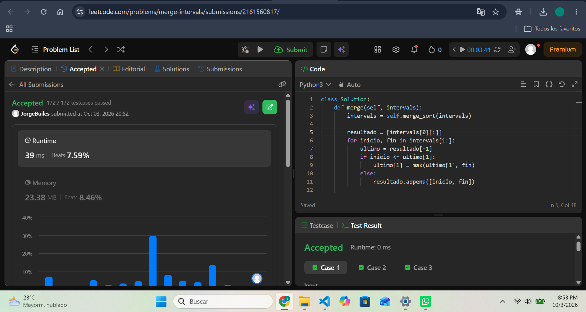
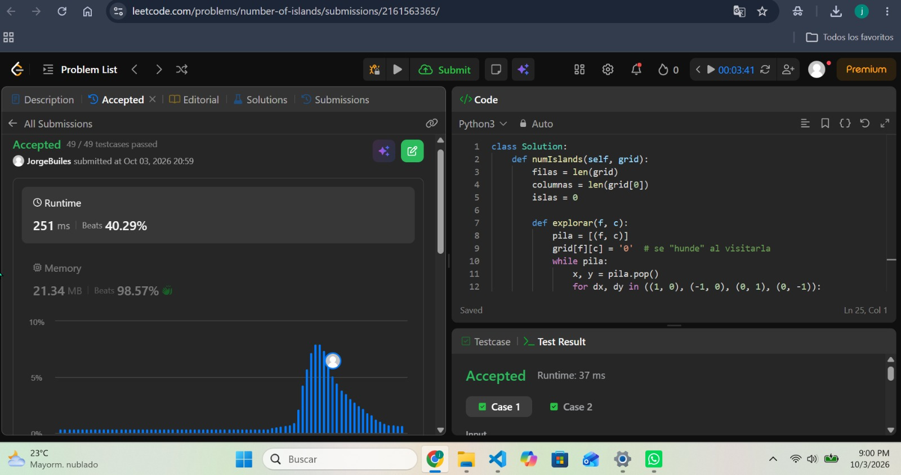
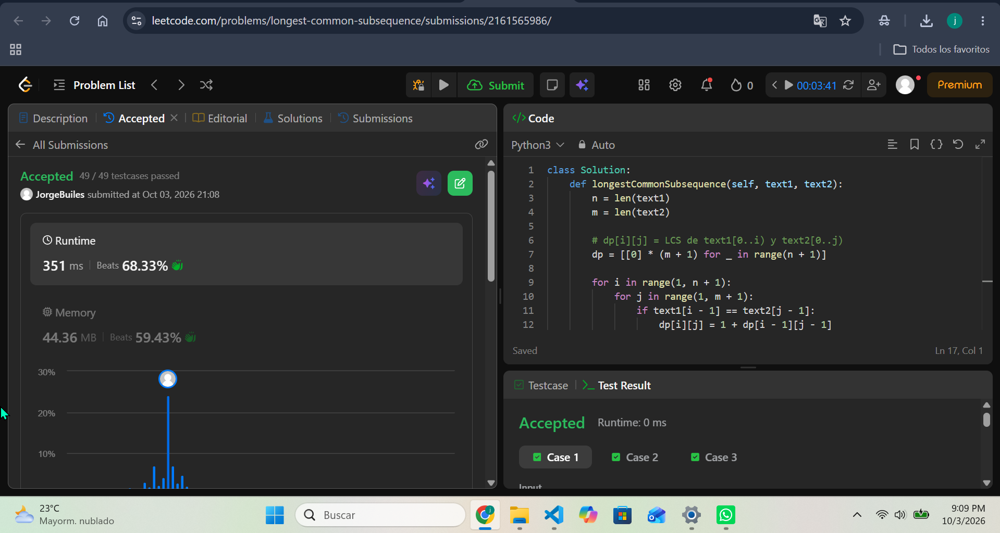
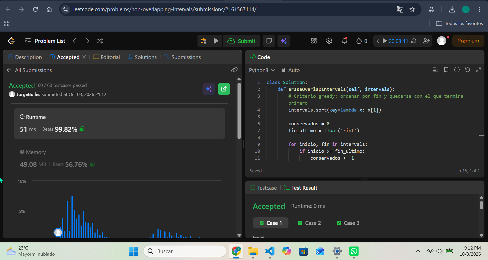
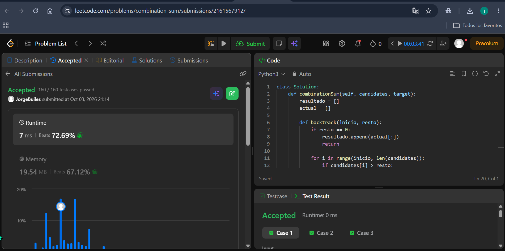

# Taller · Cinco familias en LeetCode

- **Curso:** Análisis de algoritmos · ITM · 2026-2
- **Estudiante:** Jorge Builes
- **Lenguaje:** Python 3
- **Estructura:** cada carpeta tiene su `solution.py` y las capturas de Accepted están en `evidencias/`

---

## 56. Merge Intervals

- **Enlace:** https://leetcode.com/problems/merge-intervals/
- **Familia:** ordenamiento
- **Idea:** la entrada no viene ordenada, así que la clave es el extremo izquierdo (`start`). Se ordenan los intervalos con merge sort por esa clave y después una sola pasada fusiona: si el siguiente empieza antes o justo cuando termina el intervalo abierto, se ensancha su `end` con `max`; si no, se cierra y se abre uno nuevo.
- **Complejidad:** tiempo `O(n log n)` (domina el sort, la pasada es `O(n)`); espacio `O(n)` (salida y arreglos auxiliares del merge sort), con `n` = número de intervalos.
- **Código:** [merge-intervals/solution.py](merge-intervals/solution.py)

---

## 200. Number of Islands

- **Enlace:** https://leetcode.com/problems/number-of-islands/
- **Familia:** grafos
- **Idea:** la grilla es un grafo implícito no dirigido: cada celda `'1'` es un vértice y hay arista con la vecina `'1'` de arriba, abajo, izquierda o derecha (sin diagonales). Contar islas es contar componentes conexas: cada vez que aparece un `'1'` sin visitar se suma 1 y se lanza un DFS (con pila explícita) que hunde toda la isla marcándola como `'0'`.
- **Complejidad:** tiempo `Θ(m·n)` (cada celda se visita una vez); espacio `O(m·n)` en el peor caso (la pila), con `m` filas y `n` columnas.
- **Código:** [number-of-islands/solution.py](number-of-islands/solution.py)

---

## 1143. Longest Common Subsequence

- **Enlace:** https://leetcode.com/problems/longest-common-subsequence/
- **Familia:** programación dinámica
- **Estado:** `dp[i][j]` = longitud de la LCS de `text1[0..i)` y `text2[0..j)`.
- **Base:** `dp[0][j] = dp[i][0] = 0` (un prefijo vacío no tiene nada en común).
- **Recurrencia:** si `text1[i-1] == text2[j-1]`, `dp[i][j] = 1 + dp[i-1][j-1]`; si no, `dp[i][j] = max(dp[i-1][j], dp[i][j-1])`. La respuesta es `dp[n][m]`.
- **Complejidad:** tiempo `Θ(n·m)` y espacio `Θ(n·m)`, con `n = len(text1)` y `m = len(text2)` (se puede bajar a `Θ(min(n, m))` guardando solo dos filas).
- **Código:** [longest-common-subsequence/solution.py](longest-common-subsequence/solution.py)

---

## 435. Non-overlapping Intervals

- **Enlace:** https://leetcode.com/problems/non-overlapping-intervals/
- **Familia:** greedy
- **Criterio greedy:** es la selección de actividades contada al revés. Se ordenan los intervalos por `end` y en cada paso se acepta el siguiente que no pisa al último aceptado (`start >= fin_ultimo`), o sea el que termina primero entre los que aún caben. Los que no se aceptan son los que se borran: respuesta = `n − conservados`. Dos intervalos que se tocan en un extremo no se solapan.
- **Complejidad:** tiempo `O(n log n)` (domina el sort); espacio `O(1)` extra con el sort in-place, con `n` = número de intervalos.
- **Código:** [non-overlapping-intervals/solution.py](non-overlapping-intervals/solution.py)

---

## 39. Combination Sum

- **Enlace:** https://leetcode.com/problems/combination-sum/
- **Familia:** backtracking
- **Qué se elige y qué se deshace:** se elige `candidates[i]` y se baja con el resto `resto - candidates[i]`, llamando de nuevo con el mismo índice `i` (así se puede reutilizar el número). Para no generar permutaciones repetidas nunca se vuelve a índices menores. Si `resto == 0` se copia la combinación; si un candidato supera el resto se poda esa rama; al regresar se hace `pop()` del último elegido (el backtrack).
- **Complejidad:** tiempo exponencial, `O(n^(t/min))` como cota superior, con `n` = número de candidatos, `t` = target y `min` = el candidato más pequeño (la profundidad máxima es `t/min`); espacio `O(t/min)` de pila de recursión, más la salida.
- **Código:** [combination-sum/solution.py](combination-sum/solution.py)

